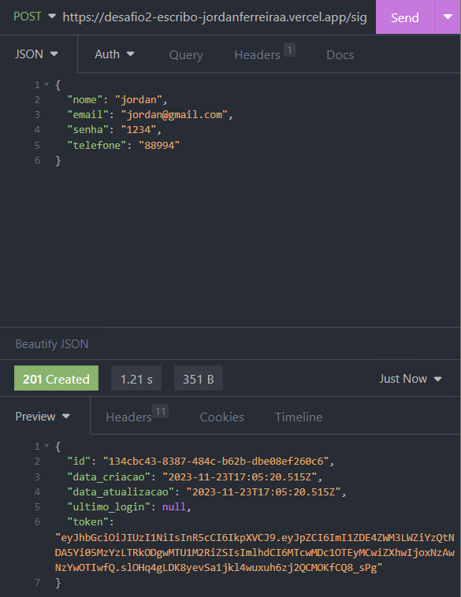
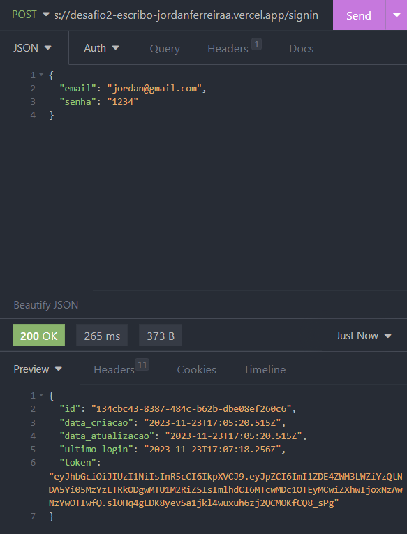
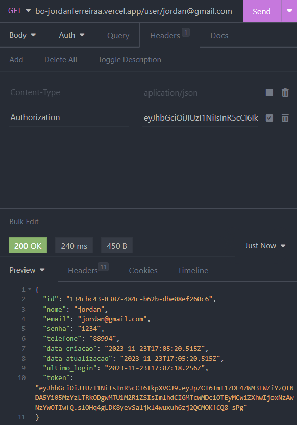

<h1 align="center" id="h1">Desafio Escribo - Backend</h1>

## Desafio
Desenvolver uma API RESTful para autenticação de usuários, que permita operações de cadastro (sign up), autenticação (sign in) e recuperação de informações do usuário.
##

## API RESTful
- Acesse a API pelo link: [Acesse](https://desafio2-escribo-jordanferreiraa.vercel.app/)
- Tecnologias e Ferramentas: JavaScript, NodeJs, Express, JWT e jsHint
##

## Requisitos
- Persistência de dados: ✅
- Sistema de build com gerenciamento de dependências: ✅
- Padronização de estilo jsHint: ✅
- Framework Express: ✅
- JWT como token: ✅
- Hospedagem: ✅
##

## Como acessar as rotas

- Utilize o Insomnia (ou outro software semelhante).
- Rotas (signup, signin, user/email):
  - POST: https://desafio2-escribo-jordanferreiraa.vercel.app/signup
  - POST: https://desafio2-escribo-jordanferreiraa.vercel.app/signin
  - GET: https://desafio2-escribo-jordanferreiraa.vercel.app/user/EMAIL@gmail.com (alterar 'EMAIL' para o email cadastrado)

### Cadastro: /signup

##
### Autenticação: /signin

##
### Buscar um email: /user:email
- Passar o token no Headers (como mostra na imagem)
  - Header: Authorization
  - Value: token_gerado

##
## Autor

- Portfolio: [ Link ](https://portfolio-jordanferreiraa.vercel.app/)
&#xa0;

<a href="#h1">Back to top</a>